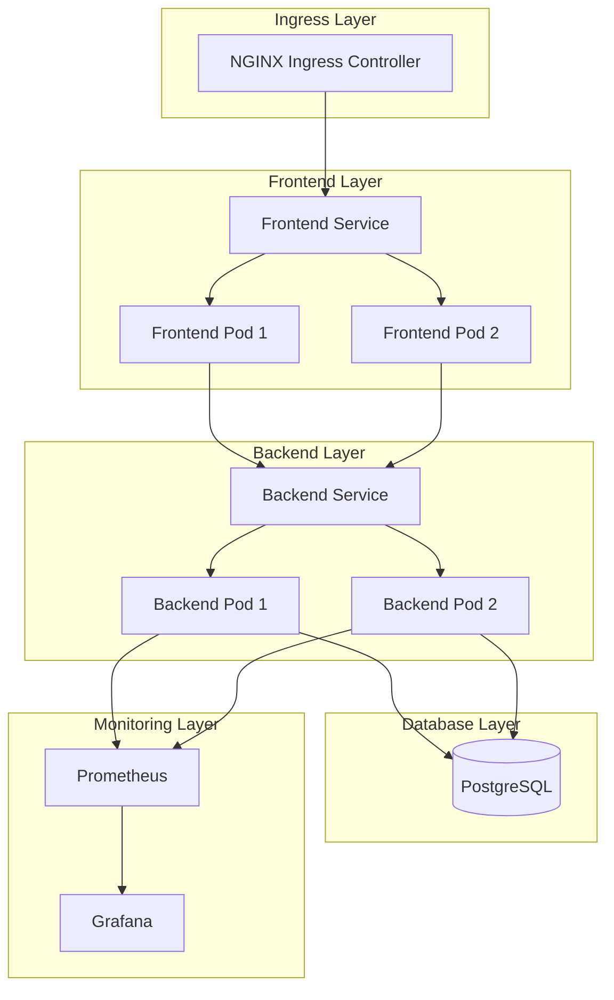

# Voting Application Architecture

## Pod Architecture

## Component Details

### Frontend Pod
- **Container**: React application
- **Resources**:
  - CPU: 50m-100m
  - Memory: 64Mi-128Mi
- **Health Checks**:
  - Liveness: HTTP GET /
  - Readiness: HTTP GET /
- **Environment Variables**:
  - REACT_APP_API_URL

### Backend Pod
- **Container**: Node.js/Express application
- **Resources**:
  - CPU: 100m-200m
  - Memory: 128Mi-256Mi
- **Health Checks**:
  - Liveness: HTTP GET /health
  - Readiness: HTTP GET /ready
- **Environment Variables**:
  - DATABASE_URL (from secrets)

### Database
- **Type**: PostgreSQL
- **Persistence**: PVC
- **Backup**: Daily automated backups

### Monitoring
- **Prometheus**:
  - Scrape interval: 15s
  - Retention: 15 days
- **Grafana**:
  - Dashboards for:
    - Request rates
    - API latency
    - Error rates
    - Resource usage

## Communication Flow
1. Client request → Ingress Controller
2. Ingress → Frontend Service
3. Frontend Service → Frontend Pods
4. Frontend Pods → Backend Service
5. Backend Service → Backend Pods
6. Backend Pods → Database
7. Metrics → Prometheus → Grafana 